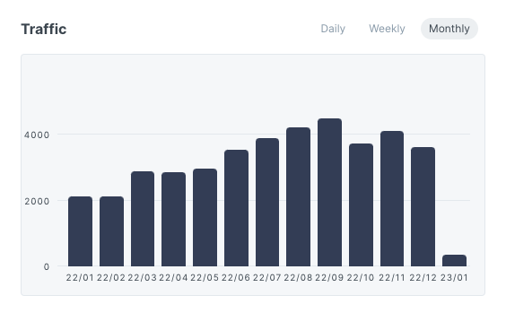

2022년엔 정말 많은 일이 있었습니다.

### 구름을 떠나면서 

2021년 12월 선임 개발자분이 퇴사하시면서 저에게 팀을 이끌 수 있는 권한이 주어졌는데요.

스스로 열심히 해보고 싶어서 근무시간에는 개발업무와 관리업무를 퇴근하고 나서는 PM강의도 구매해서 들어보고 빡빡하게 지내왔던 것 같습니다.

바이럴 마케팅이 어떻게 진행되는 지, VOC는 어떻게 처리되어야 할 지, 고객들과 어떻게 프로젝트를 이끌어야할 지, 스프린트는 어떻게 설계해야하는 지, 팀원의 고충이 무엇이고 이를 위해 어떻게 도와주면 좋을 지... 등 다방면으로 고려하고 생각해야 할 것들이 산더미였습니다.

모두에게 이익이 되는 방향으로 가기 위해서 결정을 내리고 피드백을 받아야 하는 위치에서 스스로에게 부담감이 컸습니다.

시간이 점점 지나면서 **진짜 내가 잘 하는게 무엇일까?, 지금의 나는 정체되어있진 않나?** 스스로에게 의문이 들었고 아직은 개발자로서 더 많은 것들을 경험하고 배울 시기라고 생각해 퇴사를 결심했습니다.

무엇인가 바로 회사에 들어가기보다 부족한 부분을 매꿀 시간이 필요했고 대기업으로 취직해보고 싶어서 1년이라는 시간을 투자해보기로 한 것이죠.

### SSAFY로 들어오면서

6월에 삼성 SW 아카데미 8기 공고가 올라왔고 지원을 통해 코딩테스트, 면접을 거쳐 입과하게 됐습니다.

취업을 목표로하는 동기들이랑 함께 배우면서 코딩테스트, 교육 플랫폼을 사용해보니 구름에 있었을 때, 공감하지 못했던 부분들이 하나씩 보이더군요.(출석 체크, 코딩테스트에서 필요한 니즈가 무엇인지 등) 재미있었습니다.

역시 고객의 입장에서 보는 제품과 정리된 VOC 데이터로 보는 것과는 차이가 크더라구요.

2023년엔 싸피에서 진행할 프로젝트에서 기회가 된다면 다뤄보고 싶어지네요.

### 대학생 때, 했던 프로젝트 정리 글들을 보면서

정리하는 습관도 중요하다는 걸 알게 됐습니다.

우연히 대학생 때 기록했던 [springboot 2.0](https://djunnni.gitbook.io/springboot/)의 인사이트 통계를 보게됐는데요. 지금까지 꾸준히 보시는 분들이 많다는 사실을 알았습니다.

이 정보만으로는 내 글이 과연 좋은 글인지 판별을 못하겠더라구요. 단순히 count만 높아졌다고 생각해 GA를 연결하고 2달정도를 지켜봤습니다.

평균 40초 동안 머물러 있다는 걸 확인하고 난 뒤, 좀 쪽팔리기도 하더라구요. 내용을 정비하고 처음부터 올바르게 기록하고 생각한 내용을 정리해야 겠습니다.

### hacktoberfest 2022에 참여하며

저에게 재대로 된 첫 오픈소스 기여 행사였던 것 같습니다. 그전까진 간단한 내용 고치기가 주였는데요.

1) nodejs.dev에 SearchBar 개선  
2) mdx-js에 readme docs 수정  
3) hacktoberfest 오픈소스 목록 추가

행사 기간중에 메인테이너로서 이번 행사에 대해 가지고 있는 [생각](https://github.com/mdx-js/mdx/pull/2159#issuecomment-1293281030)도 들어볼 수 있었고 만약 내가 메인테이너가 된다면 어떻게 할 지 생각해볼 기회가 됐었네요. 여러분도 기회가 되면 보시면 좋겠습니다.

holopin을 통해서 참여 이력을 뱃지로 나눠주고 있습니다. 이 부분이 신선했는데요. 깃헙에 남는 이력외에 만들어준 아이콘이 재미를 자극하더라구요.

티셔츠를 받고 싶긴 했는데 이미 남은 여분이 없어서 나무 한 그루를 선택했고 현재 그 나무가 인도에 있다고 하네요. 꽤 신선한 오픈소스 행사였습니다.
아마 내년에도 참가할 것 같네요.

추가로 외국에 대학생이나 더 어린 나이도 자유롭게 facebook이나 기타 오픈소스에 기여하고 있다는 점이 놀랬습니다. 우리나라도 활성화되면 좋겠다 싶어서 제가 참여해본 경험기와 어떻게 시작했는지 정리해서 공유해보려고 합니다.

### 등산을 다니면서

스스로 번아웃을 이기기 위해 등산을 많이 다녔습니다.

청계산을 시작으로 북한산, 무등산, 한라산을 다녔습니다. 꼭대기에 올라가면서 힘든 순간도 있지만 해낼 수 있다는 긍정적인 마인드를 놓치 않았죠.

이 기분을 다시 느껴보고 싶었던 것 같습니다.

### 자격증을 취득하면서

저는 Opic IM과 SQLD를 취득했는데요. 자격증이 전부라는 의미는 아니라고 생각합니다. 대신 조금은 알고 있구나로 보이는 용도라고 생각합니다.

없는 채로 이야기 하기보다는 무엇이라도 +a 인 상태에서 말하는게 더 신빙성이 있어보이기 때문이죠.

### 정리

스스로 많은 경험을 한 2022년 이네요. 2023년엔 부족했던 부분을 다듬어서 더 나은 개발자로 성장하고 싶어지고 목표를 잘 세워야 겠습니다.

블로그도 새롭게 여기서부터 내용을 잘 다듬어보려고 합니다.
