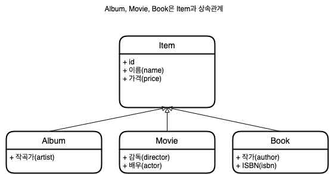
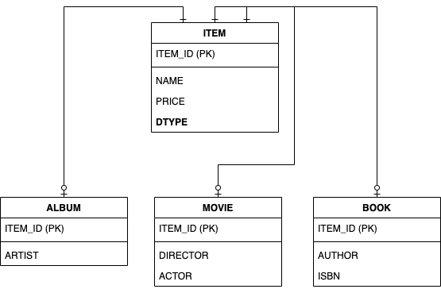

### 시작하기에 앞서
객체지향 언어에서는 상속, 다형성, 추상화, 캡슐화, 정보은닉 등을 지원한다. 또한 객체는 속성과 기능으로 구성되는데 자세한 건  [OOP](https://github.com/Djunnni/Practice-Java/tree/main/%EB%AC%B8%EC%84%9C/OOP/4%EA%B0%80%EC%A7%80%20%ED%8A%B9%EC%84%B1/oop)에서 코드로 살펴보는 걸로 대체하자.

애플리케이션은 발전하면서 그 내부의 복잡성도 점점 커진다. 지속가능한 애플리케이션을 개발하는 일은 끊임없이 증가하는 복잡성과의 싸움이다. 복잡성을 제어하지 못하면 결국 유지보수하기 어려운 애플리케이션이 된다.

### 패러다임 불일치는 왜 일어날까?

객체가 단순하면 모든 속성값을 꺼내서 파일이나 데이터베이스에 저장하면 되지만 부모 객체를 상속받았거나, 다른 객체를 참조하고 있다면 객체의 상태를 저장하기는 쉽지 않다.

예를 들어 회원 객체를 저장해야하는데 회원 객체가 팀 객체를 참조하고 있다면 회원 객체를 저장할 때 팀 객체도 함께 저장해야 한다. 단순히 회원 객체만 저장하면 참조하는 팀 객체를 잃어버리는 문제가 발생한다.

자바는 이런 문제까지 고려해서 객체를 파일로 저장하는 직렬화 기능과 저장된 파일을 복구하는 역직렬화를 제공한다.

하지만 직렬화된 객체를 검색하기 어렵다는 문제가 있어 현실성은 떨어진다.

관계형 데이터베이스는 데이터 중심으로 구조화되어 있고 집합적인 사고를 요구한다. 그리고 객체지향에서 이야기하는 추상화, 상속, 다형성 같은 개념이 없다.

객체와 관계형 데이터 베이스는 지향하는 목적이 서로 다르므로 둘의 기능과 표현 방법도 다르다. 따라서 객체 구조를 테이블 구조에 저장하는데 한계가 있다.

### JPA에서는 어떻게 이 문제를 해결할까?

#### 상속



데이터베이스 모델링에서 이야기하는 슈퍼타입 서브타입 관계를 사용하면 객체 상속과 유사한 형태로 테이블 설계가 가능하다.


(이미지에서 빠져있는데 ALBUM, MOVIE, BOOK의 PK는 PK이자 FK이다. 이유: identify 관계이므로)

객체모델 코드는 다음과 같다.

```java
abstract class Item {
    Long id;
    String name;
    int price;
}

class Album extends Item {
    String artist;
}

class Movie extends Item {
    String director;
    String actor;
}

class Book extends Item {
    String author;
    String isbn;
}
```

Album 객체를 저장하기 위해서는 이 객체를 분해해 두 SQL문장을 만들어야 한다.

1. insert into ITEM
2. insert into ALBUM

Movie도 위와 만찬가지이다.

JDBC API를 이용해 이 코드를 완성하려면 부모 객체에서 부모 데이터만 꺼내 ITEM용 INSERT SQL을 작성하고 자식 객체에서 자식 데이터만 꺼내서 ALBUM용 INSERT SQL을 작성해야 한다. 코드도 만만치 않고 자식 타입에 따라 DTYPE도 설정해야 한다.

조회도 ALBUM을 ITEM과 ALBUM테이블을 조인해서 조회해 Album객체로 생성해야한다.

이런 과정이 모두 **패러다임의 불일치**를 해결하기 위해 소모하는 비용이다.

```java
list.add(album);
list.add(movie);

Album album = list.get(albumIndex);
```

자식이나 타입에 대한 고민없이 해당 컬렉션을 그냥 사용하면 된다.

##### JPA와 상속

JPA는 상속과 관련된 패러다임의 불일치문제를 개발자 대신 해결해준다. 개발자는 마치 자바 컬렉션에 객체를 저장하듯 JPA에게 객체를 저장하면 된다.

```java
String albumId = "id000";
Album album = jpa.find(Album.class, albumId);

/**
    => SELECT I.*, A.*
        FROM Item I
        JOIN ALBUM A ON I.ITEM_ID = A.ITEM_ID
 */
```
#### 연관관계

**객체는 참조를 사용해 다른 객체와 연관관계를 가지고 참조에 접근해 연관된 객체를 조회한다.**

반면에 테이블은 외래 키를 사용해 다른 테이블과 연관관계를 참조로 사용하는 객체와 외래 키를 사용하는 관계형 데이터베이스 사이의 패러타임 불일치는 객체지향 모델링을 거의 포기하게 만들 정도로 극복하기 어렵다.

객체는 참조가 있는 방향으로만 조회할 수 있다.

##### 객체를 테이블에 맞춰 모델링

```java
class Member {
    String id;
    Long teamId;
    String username;
}
class Team {
    Long id;
    String name;
}
```

##### 객체지향 모델링

```java
class Member {
    String id;
    Team team;
    String username;
}
class Team {
    Long id;
    String name;
}
```

개발자가 직접 연관관계가 필요한데

```java
public Member find(String memberId) {
    // member 생성
    Member member = new Member();
    // team
    Team team = new Team();

    member.setTeam(team); // 이런 과정은 패러다임의 불일치를 해소하고자 소모하는 비용이다.
    return member;
}
```

##### JPA와 연관관계

JPA는 연관관계와 관련된 패러다임의 불일치 문제를 해결해준다.

### 객체 그래프 탐색

객체에 회원이 소속된 팀을 조회할 때는 다음처럼 참조를 사용해 연관된 팀을 찾으면 되는데 이를 객체 그래프 탐색이라고 한다.

```java
member.getOrder().getOrderItem()... // 자유로운 객체 그레프 탐색


// SELECT M.*, T.*
//    FROM MEMBER M
//    JOIN TEAM ON M.TEAM_ID = T.TEAM_ID
```

JPA 객체 그래프 탐색

앞 절 'SQL'을 다룰 때 발생하는 문제점에서도 언급했듯이 JPA는 연관된 객체를 사용하는 시점에 적절한 SELECT SQL을 실행한다. 따라서 JPA를 사용하면 연관된 객체를 신뢰하고 마음껏 조회할 수 있다.

이 기능은 실제 객체를 사용하는 시점까지 데이터베이스 조회를 미룬다고 **지연로딩**이라 한다.

이 기능을 사용하려면 객체에 JPA와 관련된 코드를 처리한다. 

### 동등성과 동일성

동일성(identify): ==을 이용해 객체 인스턴스의 주소값을 비교한다.
동등성(equality): equals 메서드를 사용해서 객체 내부의 값을 비교

```java
String memberId = "100";
Member member1 = memberDao.getMember(memberId);
Member member2 = memberDao.getMember(memberId);

member1 == member2; // 다르다.
```

데이터베이스의 같은 로우를 조회했지만 객체의 동일성 비교에는 실패한다. 만약 객체 컬렉션에 보관했다면 다음과 같이 동등성 비교에 성공했을 것이다.

```java
Member member1 = list.get(0);
Member member2 = list.get(0);

member1 == member2 // 같다.
```

이런 패러다임의 불일치 문제를 해결하기 위해 데이터베이스 같은 로우를 조회할 때마다 같은 인스턴스를 반환하는 것은 구현하기 쉽지 않다. 여기에 트랜젝션이 동시에 실행되는 상황까지 고려하면 문제는 더 어려워진다.

#### JPA의 비교

JPA는 같은 트랜젝션에 있을 때, 같은 객체가 조회되는 것을 보장한다. 그러므로 member1, member2는 동일성비교에 해당한다.