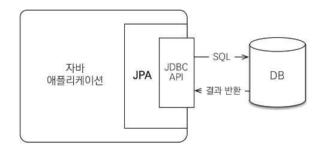
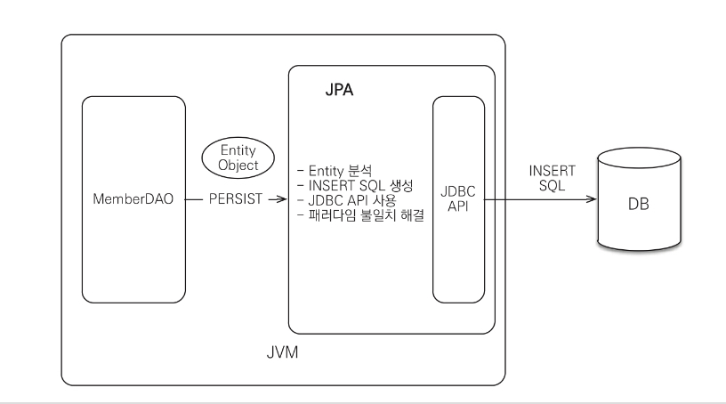
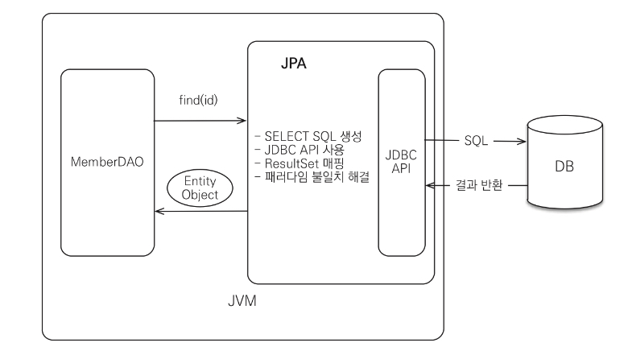
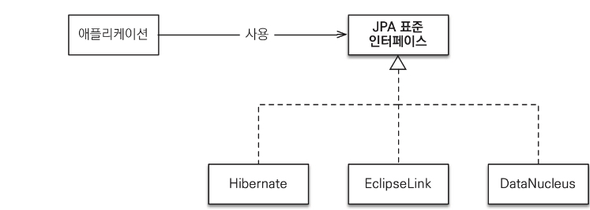

JPA(Java Persistence API)는 자바 ORM(Object Relation Mapping) 기술 표준이다. 그림과 같이 JDBC와 애플리케이션 사이에서 동작한다.

그렇다면 ORM은 무엇인가? 이름 그대로 **객체와 관계형 데이터베이스를 매핑**하는 의미다.

ORM 프레임워크는 객체와 테이블을 매핑해서 패러다임의 불일치 문제를 개발자 대신 해결해준다.

* Insert 시,

* Select 시,

자바진영에도 다양한 ORM 프레임워크들이 있지만 그 중 하이버네이트 프레임워크가 가장 많이 사용된다. 하이버네이트는 거의 대부분의 패러다임 불일치 문제를 해결해주는 성숙한 ORM 프레임워크다.

### JPA 소개

과거 자바 진영 : EJB 사용

EJB는 너무 복잡하고 기술 성숙도도 떨어지며 J2EE 서버에서만 동작

이때, hibernate(오픈소스 ORM 프레임워크)가 등장했는데 EJB에 비해 실용적이고 가벼워 기술 성숙도가 높았다.
또한 자바 엔터프라이즈 애플리케이션 서비 없이도 동작해서 많은 개발자가 사용하기 시작했다. 결국 EJB 3.0에서 하이버네이트를 기반으로 새로운 자바 ORM 기술표준이 만들어졌는데 이것이 바로 JPA다.

JPA는 자바 ORM 기술에 대한 API 표준 명세이다. 쉽게 인터페이스를 모아둔 것인데 JPA 2.1을 구현한 ORM 프레임워크로 Hibernate를 사용한다.

JPA 표준 덕분에 특정 기술 의존도를 낮출 수 있으며 손쉽게 다른 기술로 이동할 수 있다.

* JPA 1.0 : 복합키와 연관관계 기능이 부족
* JPA 2.0 : 대부분이 ORM 기능을 포함하고 JPA criteria가 추가
* JPA 2.1 : 스토어드 프로시저 접근, 컨버터, 엔티티 그래프 기능이 추가

### 왜 JPA를 사용해야 하는가?

1. 생산성
2. 유지보수
3. 패러다임 불일치 해결
4. 성능
5. 데이터 접근 추상성과 벤더 독립성
6. 표준

### 참조

자바 ORM 표준 JPA 프로그래밍 - 김영한

### 면접에서 나올 수 있는 질문거리

#### Q1. 마이바티스와 달리 JPA의 장점은 무엇인가요?

마이바티스는 SQL 매퍼의 역할을 합니다. 
**SQL을 개발자가 직접 작성하게되고** JDBC API 사용과 응답 결과를 객체로 매핑하는 일은 SQL 매퍼가 관리합니다. 

JPA의 경우 객체와 테이블을 매핑만 하면 ORM 프레임워크가 SQL을 만들어서 데이터베이스와 관련된 처리를 해주므로 SQL에 의존하는 개발을 피할 수 있습니다.

#### Q2. JPA를 통해 해결하고 싶어하는 건 무엇인가요?

1. 어플리케이션 객체와 데이터베이스 테이블간 패러다임 불일치를 해소
2. 유지보수 코드 수 감소
3. 생산성 향상
