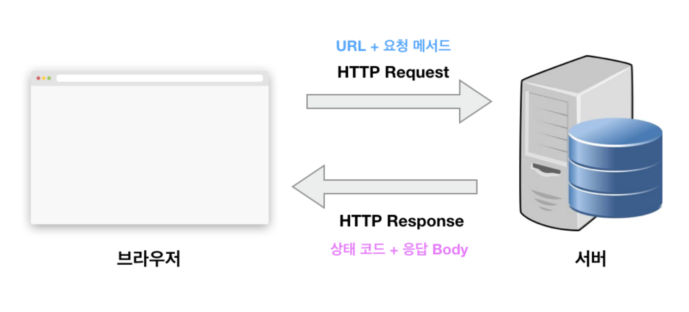

### HTTP란?

* HTTP(HyperText Transfer Protocol)
    `클라이언트`(Chrome, Firefox)와 `서버`(nginx, httpd)간의 웹상에서의 통신을 위한 Protocol(규약)이다.
    좀 더 알아보려면 [wikipedia HTTP](https://ko.wikipedia.org/wiki/HTTP)에서 알아보기


    

### HTTP/1.1

HTTP의 첫번째 표준 버전 HTTP/1.1은 1997년 초 공개

#### 단점
* HOL(Head Of Line) Blocking
    특정 응답 지연. 네트워크에서 같은 큐에 있는 패킷이 첫번째 패킷에 의해 지연될 때 발생하는 성능 저하
* RTT(Round Trip Time) 증가
    HTTP/1.1의 경우 일반적으로 Connection 하나의 요청 한개 처리
    매 요청별 Connection 생성 > TCP 3-way HandShake 반복, 불필요한 RTT 증가, 네트워크 지연 초래
* 무거운 Header
    매 요청 마다 중복 헤더 값 전송. 서버 도메인 관련된 쿠키 정보도 헤더에 함께 포함 됨
    텍스트로 데이터 전송(바이너리 아님)
    TCP 위에서 동작(3hand-shake 계속 발생)
    동기적으로 데이터 요청 진행(1개 요청하고 대기, 도착하면 그다음 데이터 요청) 등

#### 단점을 해결하기 위해 사용한 방법

1. [Image Spliting](https://www.w3schools.com/css/css_image_sprites.asp)
2. [Domain Sharding](https://developer.mozilla.org/en-US/docs/Glossary/Domain_sharding)
    * 여러개의 서브도메인을 설정해 정적파일을 병렬로 가져오는 방법
    * HTTP/1.X에서 도메인당 요청 갯수의 제한으로 도메인 샤딩 등장(모던 브라우저 6-8개, IE 하위 2개)
    * 동시요청을 함으로써 빨라질 것 같지만 로딩 속도가 무조건 그렇지는 않다. 각 하위 도메인에 DNS를 조회함으로써 꽤 많은 시간과 CPU, 전력을 소모
    * 따라서 도메인 샤딩은 동시 요청에 대한 완벽한 솔루션이라고 볼 수 없음.
    * 권장: HTTP/2 (옛날에 구글의 SPDY 프로토콜도 있었으나 포기하고 2015년 2월로 HTTP/2 지원에 동참)
3. [Minified CSS/JavaScript](https://developers.google.com/speed/docs/insights/MinifyResources?hl=ko)
4. Load Faster
    * 옛 방식
        * 스타일 시트 파일을 HTML 문서 상위에 배치, 스크립트 파일을 HTML 하단에 배치(전체 DOM을 파싱하기 전까지 스크립트 파일을 받아오지 못함)
    * 최근방식
        * async/defer head 태그에 자바스크립트 삽입 시
5. Data URI Scheme
    * HTML 문서 내 이미지 리소스를 Base64로 인코딩된 이미지 데이터로 직접 기술해 네트워크 요청을 줄이는 방법

### HTTP/2

새로운 것이 아니라, 기존의 HTTP/1.1을 발전시킨 버전이다.

#### 개선내용

1. Multiplexed Streams
    - Connection 1개로 여러개의 메시지를 주고 받음
    - 순서 상관없이 Stream으로 응답 (HTTP/1.1의 Connection Keep-Alive, Pipelining 개선 버전)

    HTTP/1.1 - HTTP 요청과 응답 구성
    `메시지`(Header/Body 등의 데이터)

    HTTP/2 - `메시지`는 다수의 Frame으로 구성(Frame과 Stream 개념 추가)
    ```
    Frame: HTTP2 통신에서 데이터를 주고받을 수 있는 가장 작은 단위(헤더 프레임, 데이터 프레임으로 구성)
    
    Stream: 클라이언트와 서버 사이에 맺어진 연결관계를 통해 양방향으로 데이터를 주고 받는 한 개 이상의 메시지
    ```
2. Stream Prioritization
    - 리소스 간 의존관계에 따른 우선 순위 설정 가능

3. Server Push
    - 클라이언트가 요청하지 않은 리소스를 사전에 서버가 푸쉬를 통해 전송
    - 클라이언트 요청의 최소화

4. Header Compression
    - `Header Table`과 `Huffman Encoding` 기법을 사용처리 (HPACK 압축방식이라고 함 (RFC 7531))

[Google Developers  HTTP/2 소개](https://web.dev/performance-http2/)에서 더 자세히 봐보기!

HTTP/2는 TLS기반에서 동작(HTTP/2 프로토콜의 이용의 조건으로 TLS HandShake를 전제)
즉, `TLS / SSH 인증서`가 필요하다.

* HTTPS(HTTP Secure)
    - TLS를 사용해 암호화된 연결을 하는 HTTP
    - 웹사이트 주소가 `https://`로 시작됨. 443 포트 사용

    - TLS와 HTTPS
        - TLS는 다양한 종류의 보안 통신을 하기 위한 프로토콜이다.
        - HTTP 뿐만 아니라 FTP, SMTP 등 프로토콜에도 적용가능
    - TLS위에 HTTP 프로토콜을 얹어 보완된 HTTP 통신 규약

:::note

HTTPS와 HTTP 헤더에 대해서는 뒷장에서 소개예정

:::

### HTTP/3

HTTP/2의 차기버전이다. 2022년 6월 6일 [RFC 9114](https://datatracker.ietf.org/doc/rfc9114/)로 표준화됨.

HTTP/1, HTTP/2와는 달리 HTTP/3는 `UDP`기반의 QUIC 프로토콜을 사용해 통신한다.
(QUIC 프로토콜(구글 자체 프로토콜)도 웹 표준이며 RFC 9000으로 표준화 되어 있음)

#### HTTP/2 대비 장점
    - Zero RTT(Round Trip Time)
    - 패킷 손실에 대한 빠른 대응
    - 사용자 IP가 바뀌어도 연결이 유지

일반적인 웹 환경에서는 2,3의 차이가 크지 않을 수 있으나, 동영상 서비스 등에서는 큰 차이를 보인다.
```
예를들어, 모바일 기기처럼 인터넷 연결 상태가 고르지 못한 경우라든지, WiFi에 연결하여 동영상을 시청하는 도중에 자리를 이탈하여 셀룰러 신호로 바뀌더라도 HTTP/3로 연결되어 있으면 영상을 끊김없이 시청할 수 있다. 패킷 전송에 있어서 제약이 거의 없는 비연결성 전송 계층을 기반으로 TCP 프로토콜의 무결성 보장 알고리즘과 SSL이 이식됨으로써 높은 성능과 동시에 충분히 괜찮은 정확성과 부인방지 특성을 충족시켰다.
```

### 참고
[[메디스트림 개발팀] HTTP (HyperText Transfer Protocol)](https://careers.medistream.co.kr/2bdf11f1-7969-442e-8877-ff7e97380db4#cf027dfe24b2489db7d0d90708a0bb40)
[도메인 샤딩](https://wonism.github.io/domain-sharding/)
[돼지왕 왕돼지 놀이터 - Domain Sharding 이란?](https://aroundck.tistory.com/5153)
[HTTP/2](https://namu.wiki/w/HTTP/2)
[HTTP/3](https://namu.wiki/w/HTTP/3)