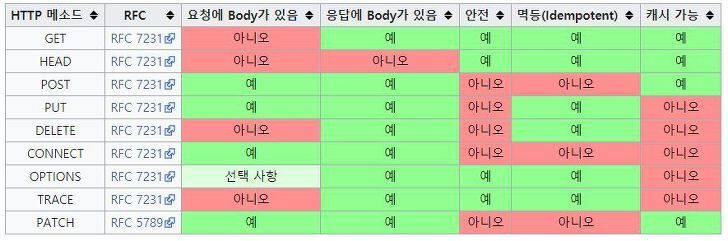

### HTTP Method란?

주어진 리소스에 대해 수행할 원하는 작업을 나타내는 일련의 `요청 메서드`를 정의한다.


| Method  | 용도 |
|---------|------|
| GET     | 지정된 리소스의 표현을 요청, 데이터를 검색하기만 해야한다.     |
| HEAD    |  GET과 요청이 동일하지만 응답 본문이 없는 응답을 요청    |
| POST    |  서버에 데이터를 추가/작성     |
| PUT     |   서버에 데이터를 갱신/작성    |
| DELETE  |   지정된 리소스 삭제   |
| PATCH   |   리소스에 부분 수정을 적용   |
| CONNECT |   목적 리소스로 식별되는 서버로 터널을 맺음  |
| OPTIONS |   리소스가 지원하고 있는 메소드의 취득   |
| TRACE   |    대상 리소스에 대한 경로를 따라 메세지 루프백 테스트를 수행  |

### 요청 메서드의 특징

* Safe(안전)
    - GET, HEAD, OPTIONS
    - 읽기 전용 작업으로 이뤄지는 경우 메서드가 안전하다.
    - 모든 안전한 메서드는 멱등성이 적용되지만 모든 메서드가 안전한건 아니다. (ex, PUT, DELETE)
* idempotent(멱등성)
    - 여러번 수행해도 결과가 같음. 여러번 호출로 인해 데이터가 변경되지 않는다는 걸 의미
* cacheable(캐시 가능)
    - 캐시 가능한 응답은 캐시할 수 있는 HTTP응답으로 나중에 검색하고 사용하기 위해 저장해 새 요청을 서버에 저장
    - GET, HEAD 메서드는 그 자체로 캐시가능
    - POST, PATCH에서는 캐시가 가능하게 할 수 있지만(신선도 정보 포함 시) 구현 X, PUT, DELETE는 캐시 가능하지 X
    - 응답에는 캐싱을 방지하는 `Cache-Control`을 사용할 수 있음

### 1. GET
    -  데이터를 읽거나 검색할 때, 사용하는 메소드
    - GET이 성공적으로 이루어지면 XML이나 JSON과 함께 200 HTTP 코드를 리턴한다.
    - ERROR가 발생하면 404나 400에러가 발생
    - 캐싱이 가능하다.

:::tip

    ```
    GET /user/djunnni
    ```

    GET에서는 캐싱이 가능해 같은 데이터를 한 번 더 조회하면 저장한 값을 사용해 조회 속도가 빨라진다.
:::
### 2. HEAD
    - GET 메서드로 요청했을 때, 응답으로 오는 헤더부분만 요청하는 메서드다.
    - 응답은 body부분을 가져선 안되며, 있다하더라도 무시해야한다.
    - 그러나 응답으로 받는 헤더에는 본문 컨텐츠를 설명하는 개체 헤더는 포함할 수 있다.
    - 왜 사용할까?
        - caching을 사용하는 클라이언트가 가장 최근에 접속한 이후로 document가 바뀌었는지를 보기 위해 사용
        - 요청에 쓰인 hypertext link의 validity, accessibility, recent modification을 테스트하기 위해 사용
### 3. OPTIONS
    URL로 지원하는 HTTP Methods를 알려준다.
:::tip

    ```
    OPTION /user/djunnni

    Allow: GET, HEAD, DELETE, PUT
    ```

::: 
### 4. POST
    - 새로운 자원(리소스)를 생성(create)할 때, 사용한다.
    - POST는 하위 리소스(부모 리소스의 하위 리소스)를 생성하는데 사용된다. 성공적으로 완료하면 201(Created)를 응답
    - POST는 멱등성이 없다.
    - 같은 POST를 반복했을 때, 항상 같은 결과물이 나오는 걸 보장하지 않는다.
    - 두개의 같은 POST 요청을 보내면 같은 정보를 담은 두 개의 다른 resource를 반환할 가능성이 높다.
### 5. PUT
    - 자원(리소스)를 생성/수정하기 위해 서버로 데이터를 보내는데 사용
    - PUT 요청은 멱등성이 있다.
    - 동일한 요청을 여러번하면 항상 같은 결과가 생성

:::tip

    ```
    PUT /user/djunnni
    body : { email: "djunnni@github.com" }
    Content-Type : "application/json"
    ```

    데이터를 수정하는 것이므로 Body, Content-Type을 작성해야 한다.
:::

### 6. PATCH
    - PUT이 자원의 전체 교체 (모든 필드 필요)
    - PATCH는 부분 교체 (자원교체시 일부 필드 필요)
    
### 7. DELETE
    - 지정된 리소스를 삭제
:::tip

    ```
    DELETE /user/djunnni
    ```

    djunnni 계정을 삭제한다.
    삭제에 성공하면 Body 값없이 성공 응답만 보내게 된다.
:::
### 8. CONNECT 
    - 요청한 리소스에 대해 양방향 연결을 시작하는 메서드
    - 프록시 서버와 같은 중간 서버 경유 (거의 사용안함)
### 9. TRACE
    - 요청 리소스가 수신되는 경로를 보여줌(거의 사용안함)

### 정리


### 참고
- [HTTP/Methods](https://developer.mozilla.org/en-US/docs/Web/HTTP/Methods)
- [Http Method 란? (GET, POST, PUT, DELETE)](https://velog.io/@yh20studio/CS-Http-Method-%EB%9E%80-GET-POST-PUT-DELETE)
- [#5 HTTP 요청방식 OPTIONS,HEAD,TRACE](https://withbundo.blogspot.com/2017/07/http-5-http-optionsheadtrace.html)
- [[HTTP METHOD] PUT vs PATCH 차이점](https://papababo.tistory.com/entry/HTTP-METHOD-PUT-vs-PATCH-%EC%B0%A8%EC%9D%B4%EC%A0%90)
- [patch는 왜 멱등성을 만족하지 못하나?](https://softwareengineering.stackexchange.com/questions/260818/why-patch-method-is-not-idempotent)
- [HTTP 응답코드 메소드 정리 GET, POST, PUT, PATCH, DELETE, TRACE, OPTIONS](https://javaplant.tistory.com/18)