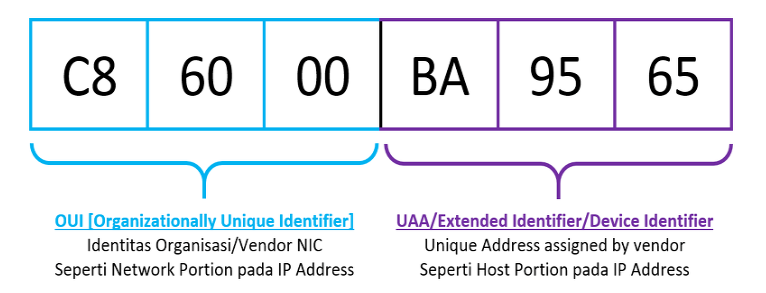

* Open System
    * 네트워크에 연결이 되어있거나 준비된 상태의 시스템

* Closed System
    * 네트워크 연결이 중단되거나 커뮤니케이션 할 수 없는 시스템

* Computer Network
    * 데이터나 미디어를 전송/수신하는 목적으로 다양한 방법으로 연결된 상호통신입니다.
    * 다양한 장비를 사용해 두 기기간 커뮤니케이션의 연결을 도움받습니다.
    * 대표적인 장비로는 라우터, 허브, 스위치, 브릿지 등이 있습니다.

* Network Topology(네트워크 망 구성방식)
    * 물리적 토폴로지
        * 노드, 링크와 같은 네트워크를 구성하는 요소들의 배치에 결정
    * 논리적 토폴로지
        * 노드들 사이의 데이터 흐름에 따라 결정
    * 요소 사진
        
    * Bus
        * 장점 - 노드의 추가, 삭제가 용이, 특정 노드의 장애가 다른 노드에 영향을 주지 않는다.
        * 단점 - 공통 배선으로 대역폭을 공유하기 때문에 노드 수가 증가하면 배선의 트래픽이 증가해 네트워크 성능이 저하됨.
    * Star
        * 장점 - 장애 발견이 쉽고 관리가 용이
        * 단점 - 주 노드에 장애가 발생하면 전체 네트워크 사용이 불가능, 통신량이 많은 경우 지연 발생
    * Mesh
        * 장점 - 특정 노드의 장애가 다른 노드에 영향을 주지 않고, 회선장애에 유연한 대처가 가능하다.
        * 단점 - 회선 구축비용이 많이 들며, 새로운 노드 추가 시 비용부담 발생
    * Ring
        * 장점 - 단방향 통신으로 신호 증폭이 가능하여 거리 제약이 적다.
        * 단점 - 노드의 추가 삭제가 용이하지 않다.
    * Tree
        * 성형의 변형으로 트리에 연결된 호스트는 허브에 연결되어 있지만 모든 중앙 전송제어 장치에 연결되어 있는 상태
        * 장점 - 하나의 허브에 더 많은 호스트 연결, 각 호스트 간의 신호 이동거리를 증가
    * Hybrid 등
> 참고 사이트
> https://itdexter.tistory.com/153
> https://www.geeksforgeeks.org/basics-computer-networking/?ref=lbp

* OSI(Open System Intercommunication)
    * 7계층으로 구성되어 각각의 계층에 맞는 기능을 제공하고 있다.
    * 계층 구성
        1. physical layer
        2. data link layer
        3. network layer
        4. transport layer
        5. session layer
        6. presentation layer
        7. application layer

* Protocol(프로토콜)
    * 두 엔티티(객체)간 어떻게 커뮤니케이션을 할 지 정의한 룰/알고리즘이다.
    * OSI 모델의 각각의 레이어에서 정의된 다른 프로토콜들이 존재한다.

* IP Address
    * logical address로 알려짐
    * IPv4에서는 32bit로 구성되어있다. 
    * 255.255.255.255(2^8의 4개 => 2^32)
    * IPv6는 128bit로 구성

* Mac Address
    * physical address로 알려짐
    * NIC(Network Interface Card)에 유니크한 값으로 기록되어 있으며 제조시, 생성된다.
    * 12-niddle / 6 byte / 48bits 로 구성된다.
    * ex) ether ab:ce:48:00:11:23 ((2^8)^(6개) = 2^48)
    * 앞 6자리는 회사가 부여받은 번호 뒤 6자리는 회사 내에서 장비를 구분하기 위해 일련번호로 만들어 부여
    * IP주소를 MAC주소로 변경하는 과정에 ARP를 사용함.
    

* IANA(Internet Assigned Nuumbers Authority)
    * 인터넷 할당 번호 관리 기관
    * 최상위 도메인, IP주소 등을 관리하는 단체로 현재 ICANN(국제 인터넷주소관리기구)이 관리하고 있다.

* Port
    * 어플리케이션으로 전송, 수신하기 위한 논리 채널이다.
    * 2^16까지 가능해 65,536개를 만들 수 있다.
    * well known
        * 범위 : 0 ~ 1023
        * IANA는 이 포트 번호들을 가장 범용적인 TCP/IP 어플리케이션을 위해 예약해둔다.
        * 시스템 관리자나 높은 권한 사용자만 사용할 수 있다.
        * System port라고도 불린다.
    * registered port
        * 범위: 1024 - 49151
        * TCP/IP를 사용하지만 RFC 표준으로 제정되지 않은 어플리케이션 포트들이 많이 있다.
        * 범위 내에서 IANA에게 요청해, 해당 포트를 어플리케이션에게 할당할 수 있다.
        * 시스템의 모든 사용자는 일반적으로 Registered Port에 접근할 수 있어 사용자 포트라고도 불린다.
    * ephemeral port
        * 범위: 49152 - 65535
        * IANA는 이들 포트를 예약하거나 관리하지 않는다. 누구나 등록 없이 사용할 수 있어 특정 기관에서만 사용하는 사설 프로토콜에 적합.
        * 특수한 어플리케이션을 위한 유연성을 제공

