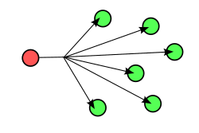
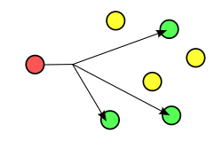

### 비교할 때, 참고할 사항
통신하는 방식에 따라 부르는 게 다르니 참고하자.
개인별, 그룹, 전부를 대상으로 하는 통신인지 아닌지 차이다.

### 유니캐스트(Uni-Cast)

Mac Address 기반으로 상대측 IP 주소를 목적지로 하는 1:1 통신 방식, 현재 네트워크 상에서 가장 많이 사용되는 방식이 유니케스트다. 

목적지에 해당하는 mac address를 모르는 IP 유니캐스트 패킷을 스위치를 통해 전달받으면 스위치에 연결된 모든 포트로 브로드캐스트 된다. 이 경우를 [unicast flood](https://ko.wikipedia.org/wiki/%EC%9C%A0%EB%8B%88%EC%BA%90%EC%8A%A4%ED%8A%B8_%ED%94%8C%EB%9F%AC%EB%93%9C)라고 한다.

전송방식은 하나의 송신자가 다른 하나의 수신자로 데이터를 전송하는 방식으로 일반적인 인터넷 응용프로그램이 모두 유니캐스트 방식을 사용하고 있다.

유니캐스트 방식은 Destination을 제외한 다른 네트워크 상의 PC들의 CPU 성능을 저하하지 않는다. 그 이유는 자신의 맥주소가 아니면 랜카드에서 해당 Frame을 버리기 때문이다.

하지만 그룹 통신을 위해서 다중 수신자들에게 동일한 데이터를 전송하고자 할 경우에 유니캐스트 방식을 사용하면 전송하고자 하는 데이터 패킷을 다수의 수신자에게 여러번 전송해야하며, 패킷의 중복 전송으로인해 네트워크 효율이 떨어진다.

### 브로드캐스트(Broad-Cast)

Local LAN 상에 붙어있는 모든 네트워크 장비들에게 보내는 통신이다. Local이란 라우터에 의해 구분된 공간, 즉 브로드캐스트 도메인이라고 하는 공간을 뜻한다. 브로드캐스트 주소는 미리 정해져있는데 이 주소가 오면 랜카드는 비록 자신의 Mac주소와 같지는 않지만 브로드캐스트 패킷을 CPU에게 전달하게 된다.

브로드캐스트는 반드시 필요한 통신방식이지만, 데이터를 수신할 필요가 없는 호스트에게도 데이터가 전송되기 때문에 불필요한 인터럽트가 발생한다. 브로드캐스트는 자신이 속한 네트워크에만 한정되며, 라우터를 경유하지 못하는 단점이 있다.

IPv6에서는 브로드 캐스트 방법을 구현하지 않았다. 그러므로 특정 트래픽을 받으려고 할 때 해당 네트워크의 모든 노드에 영향을 주지않고 트래픽을 전달하도록 구현했다.

### 멀티캐스트(Multi-Cast)

하나이상의 송신자들이 특정한 하나 이상의 수신자들에게 데이터를 전송하는 방식(그룹)

데이터를 받기 원하는 특정 호스트들에게만 보내는 것이 가능하지만, **스위치나 라우터가 이 기능을 지원해 줘야한다.**

멀티캐스트 전송을 위한 그룹 주소는 D Class IP 주소(224.0.0.0 ~ 239.255.255.255)로 전세계 개개인의 인터넷 호스트를 A,B,C 클래스 IP주소와 달리 실제 호스트를 나타내는 주가 아니며, 그룹 주소를 갖는 멀티캐스트 패킷을 전송받는 수신자는 자신이 패킷 그룹에 속해있는가를 판단해 패킷 수용여부를 결정한다.

인터넷상 대부분 라우터는 유니캐스트만 지원하기 때문에 멀티캐스트 패킷을 전송하기 위해서는 멀티캐스트 라우터 사이에 **터널링**이라는 개념을 사용해 캡슐화된 패킷을 전송한다.

멀티캐스트 주소를 가진 데이터 패킷 헤더 앞에 멀티캐스트를 지원하지 않는 일반 라우터를 거칠 경우, 기존의 유니캐스트 패킷과 같은 방법으로 라우팅되어 최종적으로 터널의 종착지에 전송될 수 있게 하는 것이다.

### 참고

[[Network] 유니캐스트, 브로드캐스트, 멀티캐스트, OSI 7 Layer 개념 정리](https://dltjrals2.github.io/network/network-concept-3/)
[위키피디아 - 라우팅](https://ko.wikipedia.org/wiki/%EB%9D%BC%EC%9A%B0%ED%8C%85)
[IPTV 서비스 기술 발전 전망](https://www.tta.or.kr/data/androReport/ttaJnal/7-5_%5B7%5D.PDF)
[CDN이란 무엇입니까?](https://aws.amazon.com/ko/what-is/cdn/)
[인터넷방송을 위한 멀티캐스트 기술 동향](https://ettrends.etri.re.kr/ettrends/75/0905000329/17-3_001_014.pdf)
[인터넷 라이브 방송은 어떤 기술로 만들어질까요?](https://medium.com/naver-cloud-platform/%EC%9D%B8%ED%84%B0%EB%84%B7-%EB%9D%BC%EC%9D%B4%EB%B8%8C-%EB%B0%A9%EC%86%A1%EC%9D%80-%EC%96%B4%EB%96%A4-%EA%B8%B0%EC%88%A0%EB%A1%9C-%EB%A7%8C%EB%93%A4%EC%96%B4%EC%A7%88%EA%B9%8C%EC%9A%94-98423dc7fcd4)

### 나올만한 질문들

1. VOD를 제공하는데 어떤 네트워크 전송방식을 사용하면 좋을 지 그리고 장단점을 비교해보시오.