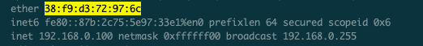

### IP주소란?

네트워크 환경에서 컴퓨터간 통신을 하기위해 부여된 네트워크 상의 주소

내 PC의 경우 현재 192.168.0.100으로 할당됨. 기본 게이트웨이는 192.168.0.1로 등록

### IP 구성

32비트로 구성되어 0~255(2^8)의 4자리로 구성되어 있다. (표현할 수 있는 수는 42억 9천개 정도)

192.168.0.100을 예로 들어보면 풀어쓰자면 다음과 같다.

|192.|168.|0.|100|
|----|----|----|----|
|11000000.|10101000.|00000000.|01100100|

### IP 주소 클래스란?

하나의 IP주소에서 네트워크와 호스트 영역을 나누는 방법(약속)

IP주소 클래스에는 총 5개의 종류가 있다. A,B,C, (D, E는 멀티캐스트, 연구용)

#### A 클래스

하나의 네트워크가 가질 수 있는 호스트가 제일 많은 클래스다. IP 주소를 32자리 2진수로 표현했을 때, 맨 앞자리수가 항상 0인 경우가 A 클래스다.

0xxx xxxx. xxxx xxxx. xxxx xxxx. xxxx xxxx

0.0.0.0 ~ 127.255.255.255의 범위를 가진다.

첫번째 옥테드는 네트워크를 나머지 부분은 호스트를 나타낸다.

네트워크 1.0.0.0 부터 126.0.0.0 까지로 규정하고 있다. 127은 제외 (약속으로 규정)

호스트 주소가 가질 수 있는 개수는 2^24 - 2개다. 

2를 빼는 이유는 다음과 같다. (모두 1인 경우 => 브로드캐스트 주소, 모두 0인 경우 => 네트워크 주소로 사용하고 있어서)

예로 13.0.0.0 ~ 13.255.255.255 범위가 있다고 하자.

13.0.0.0은 네트워크 주소를 표현하기 위해 호스트 IP로 사용할 수 없다.  
13.255.255.255는 브로드캐스트 주소로 사용하고 있어 호스트 IP로 사용할 수 없다.

#### B 클래스

10xx xxxx. xxxx xxxx. xxxx xxxx. xxxx xxxx

128.0.0.0에서 191.255.255.255 까지의 범위를 가진다.

네트워크 범위 개수는 2 ^ 14개 (xx xxxx. xxxx xxxx. 파랑색의 개수)에 해당

호스트 주소범위는 (2 ^ 16) - 2 (초록색 부분)에 해당한다.

#### C클래스

110x xxxx. xxxx xxxx. xxxx xxxx. xxxx xxxx

192.0.0.0 ~ 223.255.255.255 까지 범위를 가진다.

네트워크 범위는 110x xxxx. xxxx xxxx. xxxx xxxx. 에서 x들이 가질 수 있는 경우의 수다. (2 ^ 21)개

호스트 범위는 xxxx xxxx로 (2 ^ 8) - 2개 이다.

### 문제

문1) 10.3.4.3

 

클래스 : A

네트워크 부분 : 10.0.0.0

호스트 부분 : 3.4.3

 
문2) 132.12.11.4

 

클래스 : B

네트워크 부분 : 132.12.0.0

호스트 부분 : 11.4

 
문3) 203.10.1.1

 

클래스 : C

네트워크 부분 : 203.10.1.0

호스트 부분 : 1

 
문4) 192.12.100.2

 

클래스 : C

네트워크 부분 : 192.12.100.0

호스트 부분 : 2

 
 
문5) 130.11.4.1

 

클래스 : B

네트워크 부분 : 130.11.0.0

호스트 부분 : 4.1

### 참고

[[Network] IP주소 클래스(A,B,C class)란?](https://limkydev.tistory.com/168)