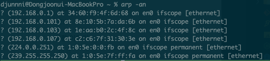

### MAC 주소

* 48비트 (6 바이트) 크기를 가진 물리적 주소(유일성)
* 노드 또는 장치의 식별성을 위해 사용

### 구성

* 앞 3바이트: OUI(Organizationally Unique Identifier)라고 함, LAN 카드 제조회사 등을 식별
* 뒤 3바이트: 제조회사가 개별적으로 붙이는 주소

* 통상 LAN카드 내 ROM에 MAC주소를 영구 기록
* MAC주소는 새겨넣는다는 뜻의 BIA(Burned-in address)라고도 함

* 무선 LAN도 같은 주소공간을 갖음

(EUI-48, EUI-64에 근거해 지정)

### 브리지 테이블 (MAC주소 테이블)

`arp -an` 명령어로 확인가능

* 브리지, 스위치가 유지관리하는 주소 테이블
    * 통상, 장치 내 RAM 상에 임시 저장(전원 OFF 또는 clear 명령어 시 삭제)

* 맥주소 테이블
    - 처음에는 빈 테이블
    - 향후 프레임의 목적 포트로의 정확한 전달을 결정하기 위해
    - 브리지 또는 스위치가 구축 유지하는 테이블

* 맥주소 테이블 기록 및 패킷 포워딩 동작
    -  수신 프레임의 MAC주소와 함께 수신 포트를 기록
    - 향후 수신된 MAC 프레임 내, 목적지 MAC주소가 테이블에 존재하면 맵핑된 포트로 MAC프레임 전달
    - 만약 테이블 내에 없다면, 플러딩(수신포트를 제외한 모든 포트들로 전달) 발생

#### 알쏠신잡

* LAN에서 Flooding
    * 스위치 등으로 수신된 프레임이
        * 목적지 주소가 멀티캐스트 또는 브로드 캐스트일 경우,
        * 목적지 주소가 자신의 MAC주소 테이블에 없을 경우,
        * 미 인식 프로토콜일 경우,
        * 프레임 버퍼 메모리가 가득 찰 경우,
        * 수신 포트를 제외한 나머지 모든 포트로 전달하게 됨 => 폭주 위험

* LAN 스위칭 등에서는 flooding에 대한 임의 포트에서 들어온 데이터를 다른 포트로 중계해버려 과부하에 대한 제어를 못함
* 2계층 LAN 상에서 플러딩을 제한하기 위한 방법이 있음
    * VLAN을 이용해 해당 VLAN만 속한 포트로 제한시켜 플러딩 시킴
    * 특정 포트에서 비정상 발신 MAC 주소를 차단하는 기능을 설정

### ARP(Address Resolution Protocol)

* 역할: MAC주소를 조회해주는 프로토콜로 L2, L3 사이에서 활동한다.

* 작동 방식: 목적지의 IP는 알고 있으나 MAC주소를 모를경우 발생
    * 브로드 캐스팅으로 내부 네트워크를 통해 IP 주인 찾는다.
    * 서브넷 네트워크의 모든 컴퓨터는 메시지를 받는다.
        * 내부 컴퓨터 중 IP가 있다면, 응답
        * 없다면, 목적지까지 가는 중의 다음 장비 주소를 적는다.

* 필요한 것
    * IP 주소 : 상대방을 찾기 위해
    * 서브넷 주소 : 같은 LAN 안에 있는지 확인하기 위해
    * 게이트웨이 주소 : 같은 LAN 안에 없을 때, 외부로 보내기 위해

#### Quiz
* 주소가 미국에 있으면 ARP를 미국까지 쏴야하나?
    * 아니다.
    * 수십개의 장비를 거치는데 맥주소는 목적지의 주소가 아니고 다음 장비의 주소가 된다.

* 찾던 놈이 아니라 다른 애가 응답하면?
    * ARP 스푸핑이 발생: 해당 IP가  아닌데 응답하면서 자신의 맥주소를 주는 것
    * 해결은 IDC 센터에서 모니터링 해서 상황에 따라 빼버려야한다.

### 참고

1. https://coding-factory.tistory.com/720
2. http://www.ktword.co.kr/test/view/view.php?nav=2&no=2902&sh=mac
3. https://popcorntree.tistory.com/85
